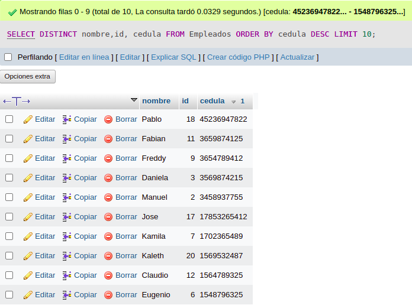

## consulta 2

1. Traer elnombre, Cedula y Salario de un empleado, ordenando los campos de la siguiente manera: Ascendente por nombre y descendente por cedula.

`SELECT NOMBRE, CEDULA, SUELDO FROM EMPLEADOS WHERE (CUIDAD='MEDELLIN') ORDER BY NOMBRE`

2. Traer el nombre y salario de los primeros 25 empleados cuyo sueldo es mayor de $600000 ordenandolos en forma ascendente por el numero de cedula.

`SELECT TOP 25 NOMBRE, SUELDO FROM EMPLEADOS WHERE (SUELDO>600000) ORDER BY CEDULA;`

3. Mostrar el nombre, id y cedula de los primeros 15 empleados cuyos nombres sean distintos. Orden la consulta en forma descendente por cedula.

`SELECT DISTINCT TOP 15 NOMBRE,ID,CEDULA FROM EMPLEADOS ORDER BY CEDULA DESC;`

4. Entregar los primeros 15 empleados con el nombre y cedula cuya ciudad sea Bogota. se necesita que los encabezados  de las columnas tengan los siguietes titulos 

`SELECT TOP 15 NOMBRE "RAZON SOCIAL". CEDULA AS "IDENTIFICACION" FROM EMPLEADOS WHERE (CIUDAD = 'BOGOTA') ODER BU CEDULA DESC:`

5. Realizar una consulta que entregue el nombre, identificion, sueldo, edad de los empleados cuyos sueldos entre $800000 y $1200000 y cuyas edades esten entre los 23 y 30 años 

6. Realizar una consulta que muestre nombre, cedula y salario de los empleados cuyo nombre comience por la letra c. ordene esta lista por salario en forma descendente 

`SELECT NOMBRE, CEDULA, SUELDO FROM EMPLEADOS WHERE (NOMBRE LIKE 'C%')ORDER BY SUELDO DESC`

